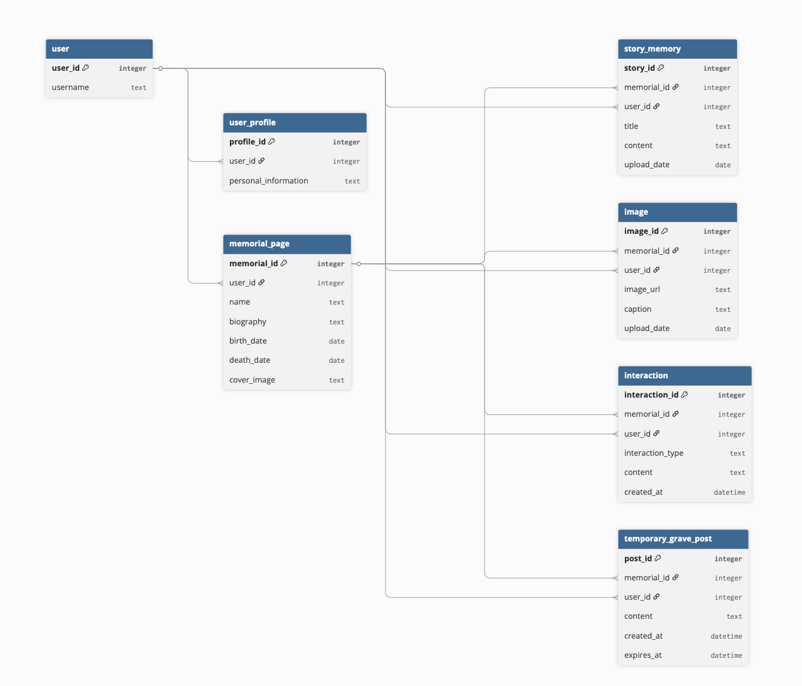

Here I will write about all of the yhings.....

this is a markdown, so i can **use markdown**

# DDD

Memorial pages were identified as the central entity of the platform rather than user profiles. Most interactions, uploaded content, and management systems connect back to memorial pages instead of individual users.

During the DDD process in class, we noticed that “memorial content” was too broad to remain as a single attribute. It contained different types of data, including stories, uploaded images, personal information, and interactions. Because of this, several sections were separated into their own entities to make the system structure clearer and easier to manage later during development.

## User

```
| attribute | description | example |
|---|---|---|
| user_id | User ID | 001 |
| username | Display name | Powei |
```

<br><br>

## Memorial page

```
| attribute | description | example |
|---|---|---|
| memorial_id | Memorial ID | 001 |
| user_id | Creator / owner | 001 |
| name | Name | John Smith |
| biography | Bio | “Loved travelling and photography.” |
| birth_date | Born | 1945 |
| death_date | Died | 2021 |
| cover_image | Image | memorial_01.png |
```

<br><br>

## Story / Memory

```
| attribute | description | example |
|---|---|---|
| story_id | Story ID | 102 |
| memorial_id | Connected memorial | 001 |
| user_id | Uploaded by | 001 |
| title | Story title | “Family camping trip” |
| content | Story content | “He always carried a camera…” |
| upload_date | Upload date | 2026-05-14 |
```

<br><br>

## Interaction

```
| attribute | description | example |
|---|---|---|
| interaction_id | Interaction ID | 301 |
| memorial_id | Connected memorial | 001 |
| user_id | Created by | 001 |
| interaction_type | Interaction type | Flower |
| content | Interaction message | “Rest in peace.” |
| created_at | Creation time | 2026-05-14 18:30 |
```

<br><br>

## Temporary grave post

```
| attribute | description | example |
|---|---|---|
| post_id | Temporary post ID | 501 |
| memorial_id | Connected memorial | 001 |
| user_id | Created by | 001 |
| content | Emotional message | “I still miss you.” |
| created_at | Creation time | 2026-05-14 20:00 |
| expires_at | Deletion time | 2026-05-21 20:00 |
```


# ERD

While building the ERD, we kept memorial pages as the central data entity because most core actions connect back to them. Users can browse memorial pages, read stories, view optional images, and leave interactions.

Another decision was keeping the structure mostly one-to-many. This avoids building a complex social network structure and keeps the system focused on memorial content and emotional interaction.

Temporary grave posts were also redefined during this process. Instead of becoming a standalone social posting system, they function more as part of the interaction lifecycle. Users leave short text interactions, while the system automatically manages post expiry and deletion through time-based data.

```
User
│
├── owns / manages Memorial Page
│
├── uploads Story / Memory
│
├── uploads optional Image
│
└── leaves Interaction
        └── may become Temporary Grave Post

Memorial Page
│
├── contains Story / Memory
├── contains optional Image
├── receives Interaction
└── contains Temporary Grave Post
```

## Relationships

User 1 ─── many Memorial Page  
One user can create or manage many memorial pages.

Memorial Page 1 ─── many Story / Memory  
One memorial page can contain many stories or memories.

Memorial Page 1 ─── many Image  
One memorial page can contain optional uploaded images.

Memorial Page 1 ─── many Interaction  
One memorial page can receive many flowers or short text interactions.

User 1 ─── many Interaction  
One user can leave many interactions on different memorial pages.

User 1 ─── 1 User Profile  
One user has one profile for account settings, saved interactions, and personal information.

Memorial Page 1 ─── many Temporary Grave Post  
One memorial page can contain many temporary grave posts, which are automatically managed by the system.



```test 
code blocks and all that 
```
You might want to revisit [https://www.
markdownlang.com/cheatsheet/](https://www. markdownlang.com/cheatsheet/)to refresh
yourself on Markdown syntax.